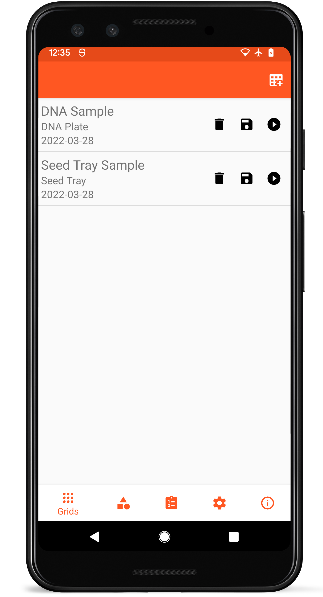

Coordinate
==========

Introduction
------------

Coordinate is a flexible, open-source Android app that is used to
collect and organize samples. Coordinate functions by defining templates
and then collecting data in grids created from those templates.

Download
--------

Coordinate can be downloaded from [Google
Play](https://play.google.com/store/apps/details?id=org.wheatgenetics.coordinate).
Source code for Coordinate is hosted on
[GitHub](https://github.com/PhenoApps/Coordinate/).

Layout
------

<figure align="center" class="image">
   
  <figcaption><i>Main Coordinate layout</i></figcaption> 
</figure>

Coordinate utilizes a bottom navigation toolbar that allows you to
quickly switch between <a href="#/grids">Grids</a>,
<a href="#/templates">Templates</a>, <a href="#/projects">Projects</a>, and <a href="#/settings">Settings</a>. The top
toolbar is reserved for actions relevant to each section of the app.
