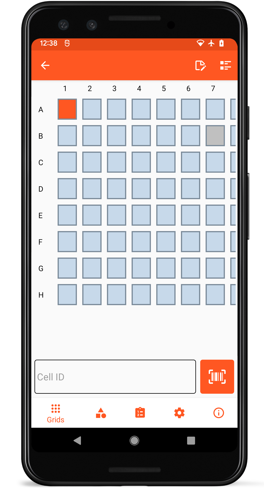

# Collecting data

<figure class="image">
   
  <figcaption class="screenshot-caption"><i>Data collection screen</i></figcaption> 
</figure>

To start collecting data, create and open a new [grid](grids.md).
Each cell within a grid can hold a single string of data (such as a plant barcode).
Data can be input via the text box below the grid.
Sample barcodes can be rapidly scanned to increase data throughput using the barcode button next to data textbox ().

The current cell is highlighted in orange.
Cells containing saved data turn dark blue.
Cells that have been excluded from holding data in a given grid are grey.

The top toolbar has additional relevant actions.
Metadata for the active grid can be viewed by selecting the Metadata icon () on the top toolbar.
The active grid can be added to an existing or new project via the Project Editor icon () on the top toolbar.