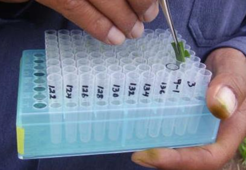
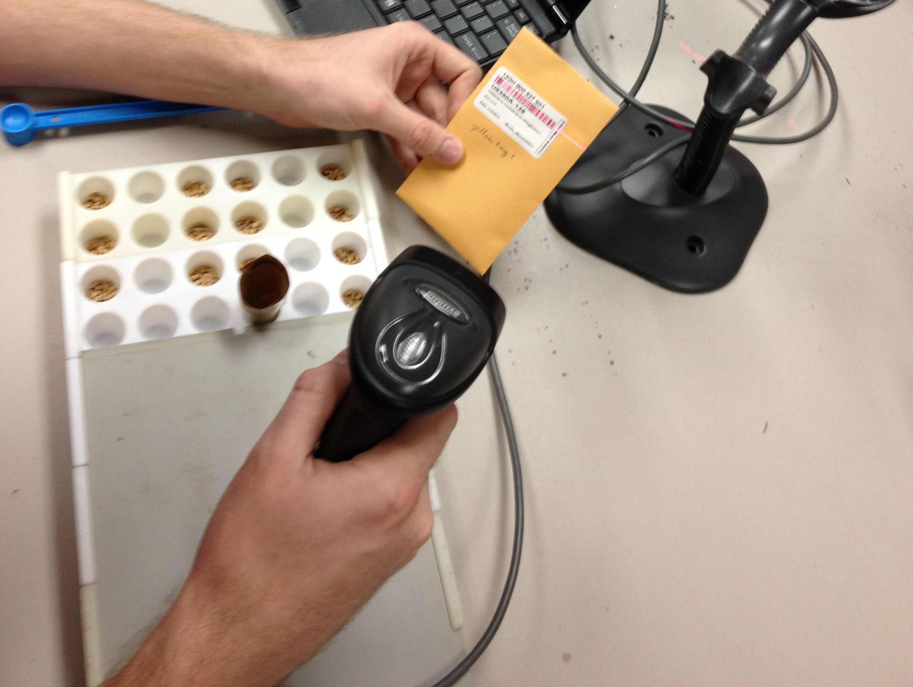

# Example Applications

## Tissue collection for genotyping

Collecting and organizing tissue samples is important in genotyping workflows where thousands of samples can be collected and must be individually tracked throughout the genotyping process. Keeping records via writing and transcribing can result in errors that break the linkage between sample identity and genotypic data. The `DNA Plate` template creates an 8 x 12 virtual plate to track sample identifiers as tissue is collected. Sample IDs can be input via sample barcodes or manually entered. Exported sample lists from the DNA Plate template can be uploaded to compatible databases.

<figure class="image">
   
  <figcaption class="screenshot-caption"><i>Collecting plant tissue for DNA extraction</i></figcaption> 
</figure>

## Seed organization for planting

Many plant breeding programs utilize progeny-rows, small experimental units that are individually planted with seed derived from a single individual. Wheat breeding progeny-rows rely on short, mechanically planted experimental units, called headrows, for early generation testing. The mechanical planting uses trays which consist of a grid of small cones, each holding a few grams of seed. Breeders plant thousands to tens-of-thousands of headrows each season which requires hundreds of headrow trays. To ensure downstream phenotypic data is collected on the correct plants, headrows must be accurately mapped to their respective field position. The `Seed Tray` template is used to track seeds as they're organized into 6 x 20 headrow trays. Exported files include the seed identifiers along with the spatial information that is used during the field season for phenotypic data collection.

<figure class="image">
   
  <figcaption class="screenshot-caption"><i>Packing a wheat seed tray</i></figcaption> 
</figure>