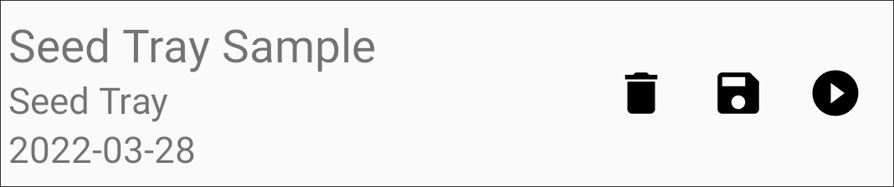
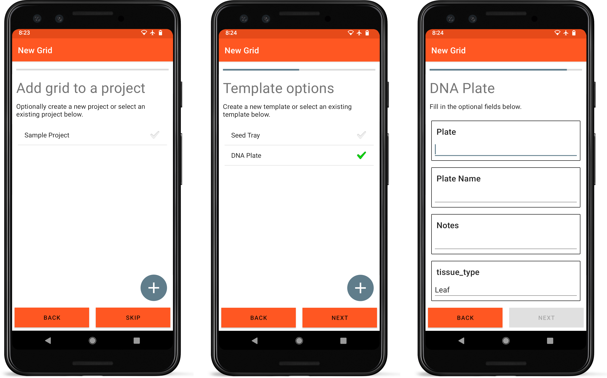

Grids
=====

<figure align="center" class="image">
   
  <figcaption><i>Grid list layout</i></figcaption> 
</figure>

Grids are the basic unit through which data is collected within
Coordinate. Each grid inherits its structure from its parent template.
Grids can exist by themselves or as a group within a project.

List Item Layout
----------------

<figure align="center" class="image">
   
  <figcaption><i>Individual grid list item</i></figcaption> 
</figure>

Each grid in the list contains the grid name or identifier, parent
template, and date created on the left.

Action buttons on the right of each list item allow a grid to be deleted
(), exported
(), or data to be
collected ().

New Grids
---------

Grids can be created by selecting the New Grid icon
() from the top
toolbar, a template list item, or a project list item. Creating a new
grid opens a step-wise process.

<figure align="center" class="image">
   
  <figcaption><i>Grid creation
process</i></figcaption> 
</figure>

1.  New grids can optionally be added to an existing project. A new
    project can also be created from this screen.
2.  The template that will be used to define the grid is selected. A new
    template can also be created from this screen.
3.  Metadata specific to the grid that will be collected is input.

Deleting Grids
--------------

Deleting a grid will delete all of the entries and data that was
collected within that grid.
