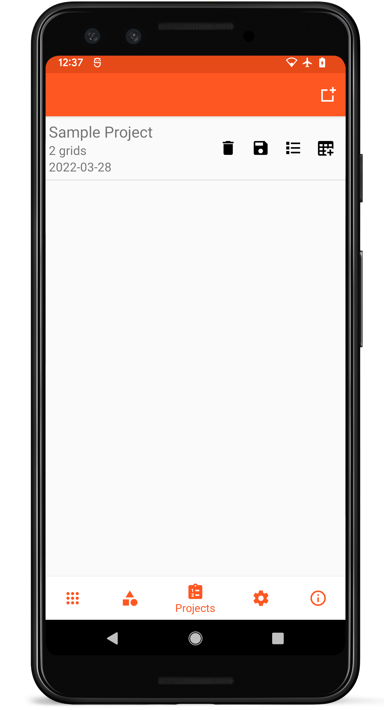
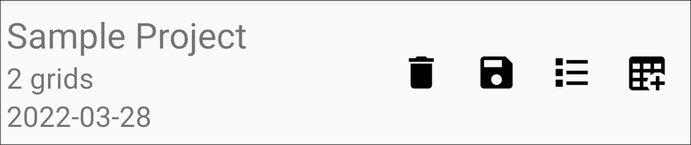

Projects
========

<figure align="center" class="image">
   
  <figcaption><i>Project list
layout</i></figcaption> 
</figure>

Groups of grids can be organized into a single project, simplifying data
collection for larger experiments. Projects can be exported as a single
file or multiple files, adjustable in the <a href="#/settings">Settings</a>. Grids can be added to Projects when they\'re created or
from the <a href="#/collect">Collect</a> screen.

List Item Layout
----------------

<figure align="center" class="image">
   
  <figcaption><i>Individual project list
item</i></figcaption> 
</figure>

Each project in the list contains the project name, number of grids, and
date created on the left.

Action buttons on the right of each list item allow a project to be
deleted (), exported
(), grids in the project
to be viewed (),
or new grids to be created from that project
().

New Projects
------------

New projects can be created by clicking the New Project icon
() on the
top toolbar. New projects only require a name to be created.

Deleting Projects
-----------------

Deleting a project will delete all of the grids within that project.
