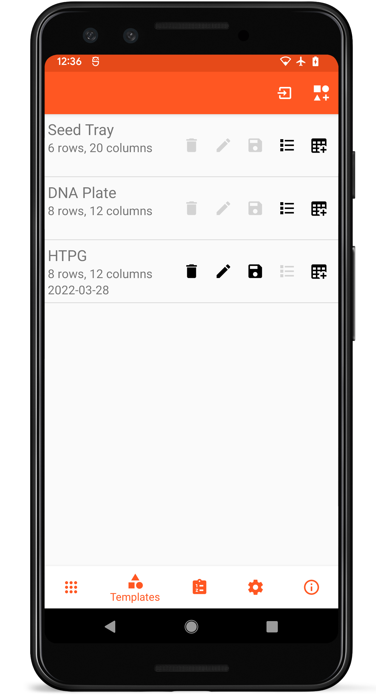
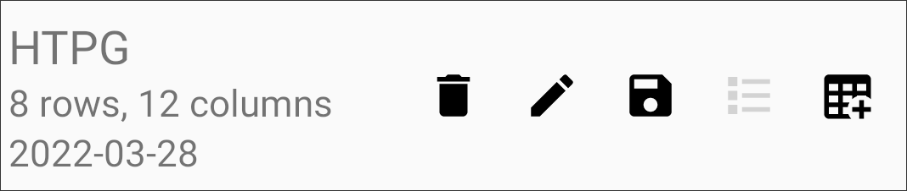
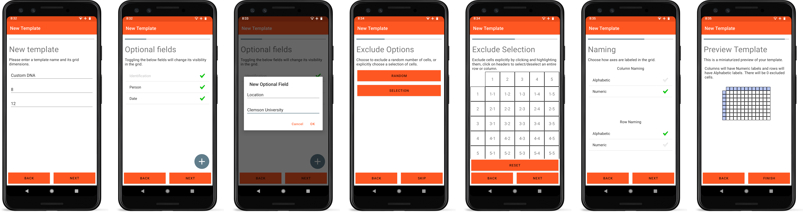

Templates
=========

<figure align="center" class="image">
   
  <figcaption><i>Template list layout</i></figcaption> 
</figure>

Templates allow defined structure and metadata across different grids
that might be collected. Two templates are included by default, a 6x20
Seed Tray Template and a 8x12 DNA Plate template.

List Item Layout
----------------

<figure align="center" class="image">
   
  <figcaption><i>Individual template list item</i></figcaption> 
</figure>

Each template in the list contains the template name, size, and date
created on the left.

Action buttons on the right of each template list item allow non-default
templates to be deleted
(), edited
(), exported
(), grids created from
that template to be viewed
(), or new grids
to be created from that template
().

New Templates
-------------

Templates can be created by selecting the New Template icon
() or
imported by selecting the Import icon
() on the top toolbar.
Creating a new template opens a step-wise process that allows for
additional customization.

<figure align="center" class="image">
   
  <figcaption><i>Template creation process</i></figcaption> 
</figure>

1.  The name and dimensions of the template are defined
2.  Metadata fields are selected or created
3.  Metadata fields can optionally have default values (e.g. \"Clemson
    University\")
4.  Random or specific cells can be excluded
5.  Specific cells to be excluded are selected
6.  Row and column names can increment numerically or alphabetically
7.  A preview of the template is created for the user to inspect

Editing Templates
-----------------

Templates can only be edited if no grids have been created using that
template.

Deleting Templates
------------------

Deleting a template will delete all of the grids created using that
template. Default templates cannot be deleted.
