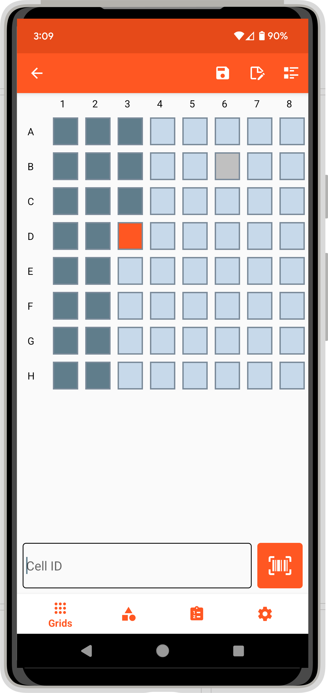

# Summary

Efficient and accurate sample organization is one of the most important aspects of modern biological science. `Coordinate` is an Android application that is used to organize sample identifiers into virtual grids. Sample identifiers are collected via text or barcode into individual cells that are structured in a Cartesian coordinate grid. Grids inherit properties from user-defined templates including their dimensions, row and column naming, metadata fields, and any specific cells to exclude from data entry. Grids are exported as CSV files that are easily integrated into downstream analysis pipelines since metadata fields are user-defined. Grids can also be grouped into projects and exported as a single ZIP file. `Coordinate` can be further customized with options to change the direction of cell procession for data input, add notification sounds, input random blank cells for quality control, and adjust the level of uniqueness required for incoming sample identifiers. Two default templates are included with `Coordinate`: DNA Plate and Seed Tray.

# Statement of need

Statistical power increases with the number of samples being used for analysis, but managing samples at scale requires optimized tools and worfklows to minimize mistakes. Organizational errors impede scientific progress and can lead to erroneous results or publication retractions [@Ying:2013;@Lee:2013;@Moloney:2017]. Many life science research activities organize samples into grids and require metadata to be collected for downstream analyses. `Coordinate` enables robust and customizable grid-based data collection by creating a mobile, virtual grid layout that can be populated as samples are collected. In contrast to unstructured approaches, `Coordinate` provides standardized data workflows that reduce mistakes and allow for more efficient sample collection.

# Example applications

## Tissue collection for genotyping

Collecting and organizing tissue samples is important in genotyping workflows where thousands of samples can be collected and must be individually tracked throughout the genotyping process. Keeping records via writing and transcribing can result in errors that break the linkage between sample identity and genotypic data. The `DNA Plate` template creates an 8 x 12 virtual plate to track sample identifiers as tissue is collected (\autoref{fig:fig1}). Sample IDs can be input via sample barcodes or manually entered. Exported sample lists from the DNA Plate template can be uploaded to compatible databases [@Morales:2022].

## Seed organization for planting

Many plant breeding programs utilize progeny-rows, small experimental units that are individually planted with seed derived from a single individual. Wheat breeding progeny-rows rely on short, mechanically planted experimental units, called headrows, for early generation testing. The mechanical planting uses trays which consist of a grid of small cones, each holding a few grams of seed. Breeders plant thousands to tens-of-thousands of headrows each season which requires hundreds of headrow trays. To ensure downstream phenotypic data is collected on the correct plants, headrows must be accurately mapped to their respective field position. The `Seed Tray` template is used to track seeds as they're organized into 6 x 20 headrow trays. Exported files include the seed identifiers along with the spatial information that is used during the field season for phenotypic data collection.

# Figures

{width="33%"}

# Additional resources

Documentation for Coordinate is available at https://coordinate.phenoapps.org. Coordinate can be downloaded from Google Play at https://play.google.com/store/apps/details?id=org.wheatgenetics.coordinate.

# Acknowledgements

The development of Coordinate was supported by the National Science Foundation under Grant No. (1543958). This app is made possible by the support of the American People provided to the Feed the Future Innovation Lab for Crop Improvement through the United States Agency for International Development (USAID) under Cooperative Agreement No. 7200AA-19LE-00005. The contents are the sole responsibility of the authors and do not necessarily reflect the views of USAID or the United States Government. We also thank Peter Rosario for his contributions to the code base.

# References
