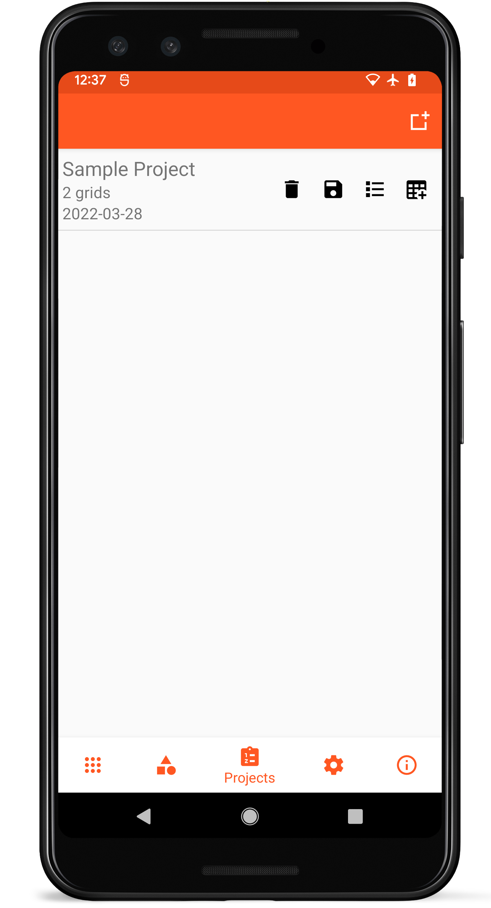
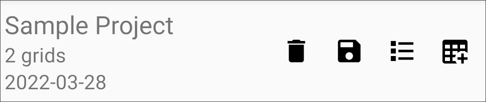

# Projects

<figure class="image">
   
  <figcaption class="screenshot-caption"><i>Project list layout</i></figcaption> 
</figure>

Groups of grids can be organized into a single project, simplifying data collection for larger experiments. Projects can be exported as a single file or multiple files, adjustable in the [Settings](settings.md).
Grids can be added to Projects when they\'re created or from the [Collecting Data](collect.md) screen.

## List Item Layout

<figure class="image">
   
  <figcaption class="screenshot-caption"><i>Individual project list item</i></figcaption> 
</figure>

Each project in the list contains the project name, number of grids, and date created on the left.

Action buttons on the right of each list item allow a project to be deleted (), exported (), grids in the project to be viewed (), or new grids to be created from that project ().

## New Projects

New projects can be created by clicking the New Project icon () on the top toolbar.
New projects only require a name to be created.

## Deleting Projects

Deleting a project will delete all of the grids within that project.
