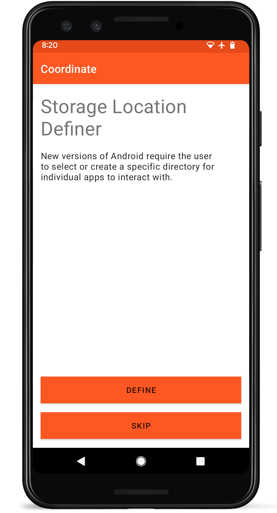

<link rel="stylesheet" type="text/css" href="_styles/styles.css">

# Storage

## Storage Location Definer

<figure class="image">
   
  <figcaption class="screenshot-caption"><i>Storage location definer layout</i></figcaption> 
</figure>

After installing and opening the app, you will be asked to define a **Storage location** on the device.
Although this is an optional step, selecting this directory will greatly simplify the export process by keeping all exported files organized.

If you skip defining the **Storage location** directory, you will be required to select an export location and name for each file that is exported from Coordinate.
The selected **Storage location** can be changed in the [Settings](settings.md).

## Subdirectories

There are three subdirectories within the *Storage location* directory: `Exports`, `Templates`, and `Database`.

-   `Exports`: contains the grid files that are exported after collecting data
-   `Templates`: contains the template files that can be exported and shared between devices
-   `Database`: contains the database files that can be exported and used to help with debugging or moving to a new device
